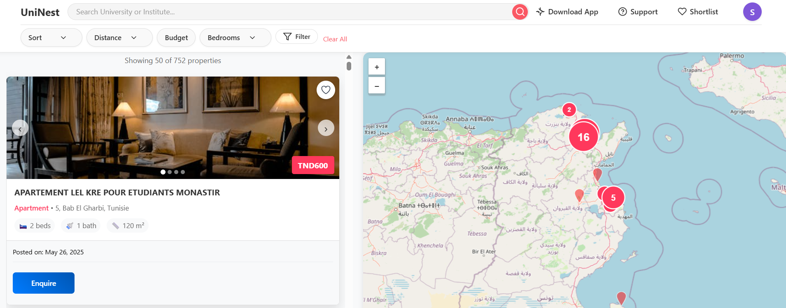
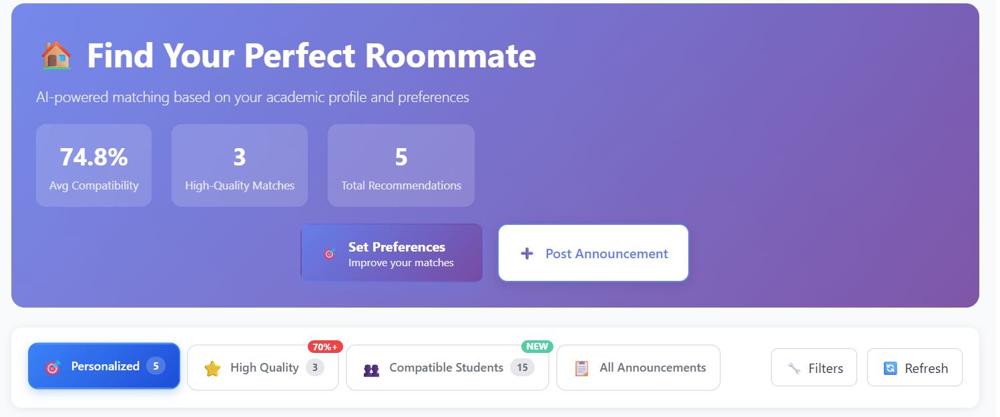
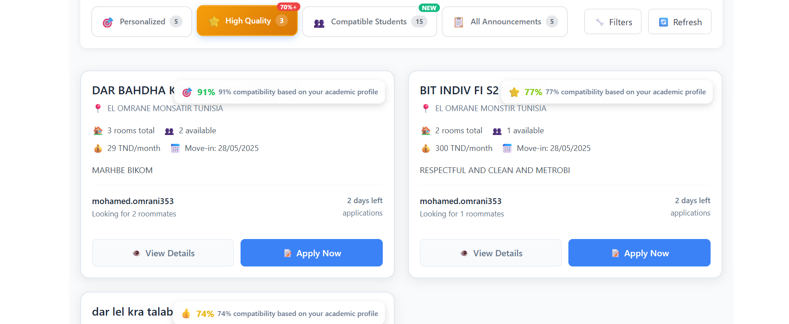
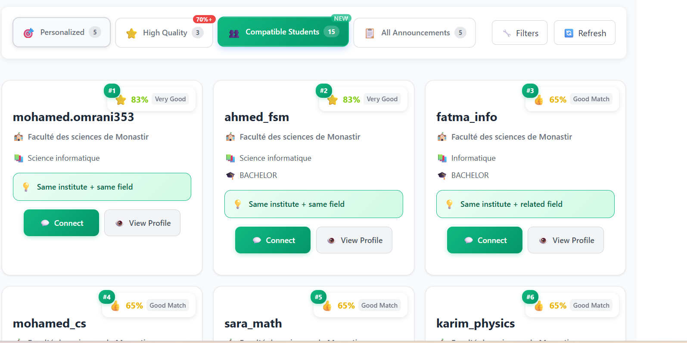
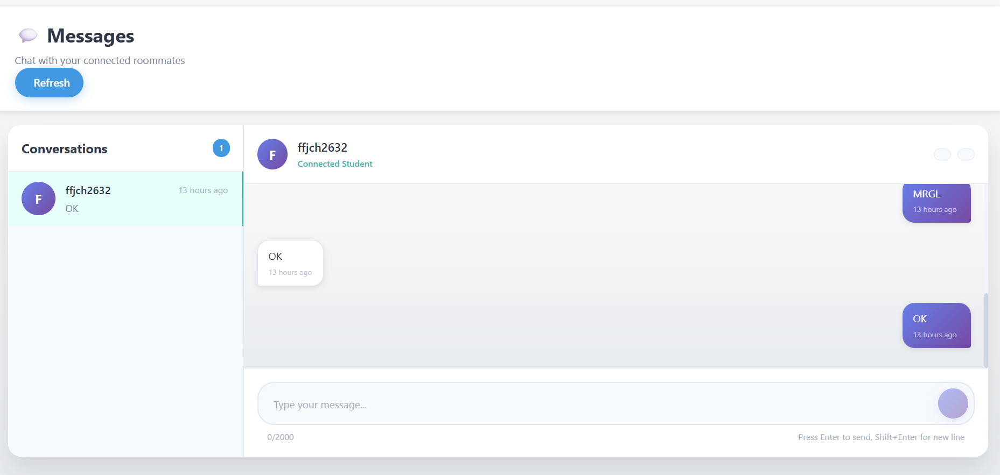
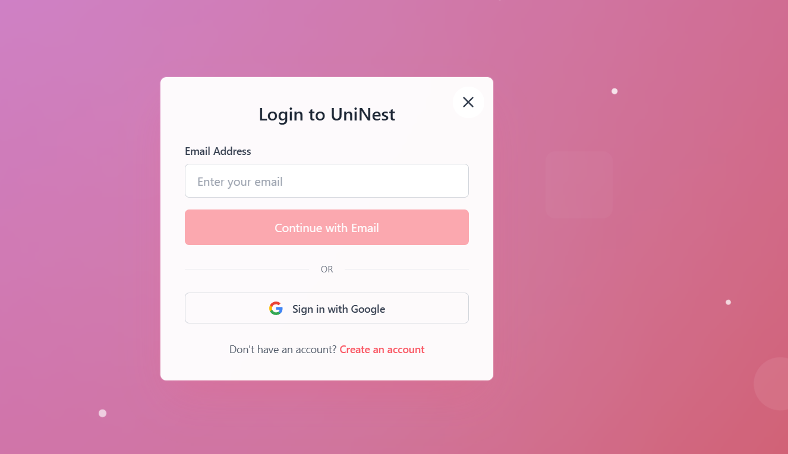
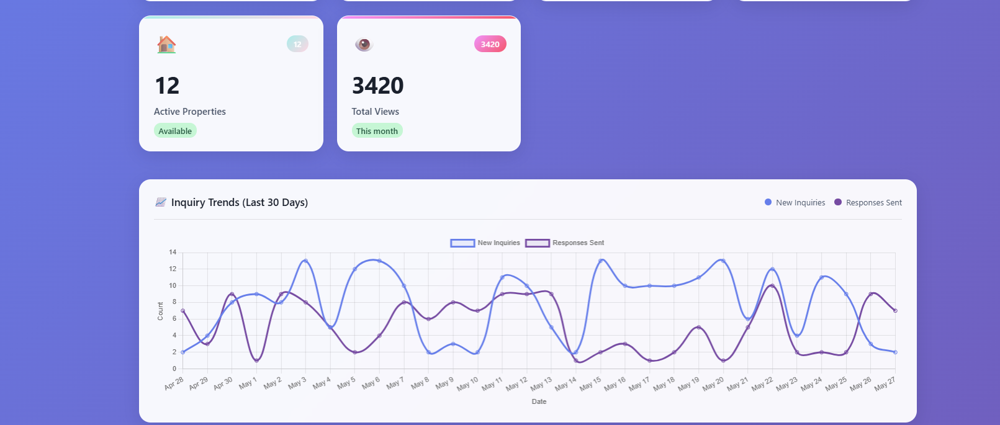
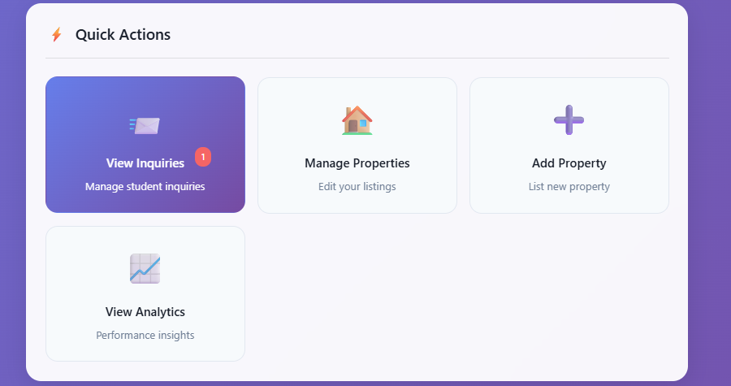
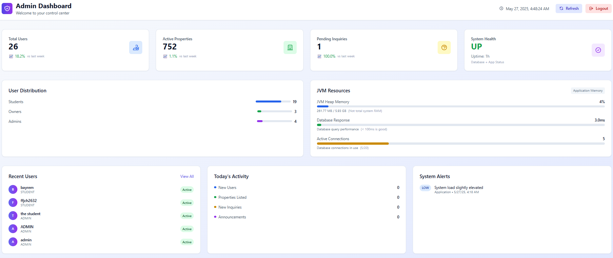
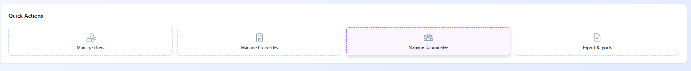

# UniNest - PFE Final Year Project 🏠🎓

## 📖 Introduction

In Tunisia, university students face significant challenges when searching for suitable accommodation and compatible roommates, often spending weeks or even months navigating fragmented rental markets, unreliable listings, and inefficient communication channels. 

**UniNest** addresses these critical pain points by providing a comprehensive digital platform that streamlines the entire student accommodation ecosystem in Tunisia. Our platform leverages advanced compatibility algorithms to match students with suitable roommates based on academic backgrounds, lifestyle preferences, and personal habits, while simultaneously offering a curated database of verified property listings with detailed information, high-quality images, and transparent pricing.

By integrating intelligent recommendation systems, real-time communication tools, and comprehensive search filters, UniNest transforms the traditionally stressful and time-consuming process of finding student accommodation into an efficient, reliable, and user-friendly experience. The platform not only saves students countless hours of searching but also increases the likelihood of successful, long-term housing arrangements by facilitating informed decision-making through detailed property information, roommate compatibility scoring, and streamlined inquiry management between students and property owners.

## 🛠️ Technology Stack

### Backend
- **Framework**: Spring Boot 3.x
- **Security**: Spring Security with JWT Authentication
- **Database**: PostgreSQL with JPA/Hibernate
- **API**: RESTful Web Services
- **Web Scraping**: Playwright for automated data collection
- **Authentication**: OAuth2 integration
- **Notifications**: WebSocket for real-time communication

### Frontend
- **Framework**: Angular 18+
- **Styling**: CSS3 with modern responsive design
- **Maps**: Interactive map integration for geospatial search
- **UI Components**: Custom component library
- **State Management**: Angular Services with RxJS

### DevOps & Tools
- **Build Tool**: Maven
- **Database Migration**: Flyway
- **File Storage**: Local storage with image optimization
- **Development**: Hot reload and live development server

## 👥 System Actors

### 🎓 Student
- Searches for rental listings with advanced filtering
- Sets preferences and connects with potential roommates
- Manages inquiries and communication with property owners
- Creates and manages roommate announcements

### 🏠 Owner
- Publishes and manages property announcements
- Responds to student inquiries and manages communications
- Updates listing details and property availability
- Accesses analytics and insights about their properties

### 👨‍💼 Administrator
- Oversees user accounts and system moderation
- Monitors listings for quality and compliance
- Manages system health and web scraping operations
- Accesses comprehensive system analytics and reports

## 🚀 Core Features

### 🔍 Property Management & Discovery
- **Advanced Search**: Multi-criteria filtering (location, price, type, amenities)
- **Interactive Maps**: Geospatial search capabilities with map-based browsing
- **Comprehensive Listings**: Detailed property management with image uploads
- **Real-time Updates**: Automated property availability and status management
- **Academic Proximity**: Institute-based location search with radius filtering

*Property Discovery Interface*

### 🤝 Intelligent Roommate Matching System
- **Compatibility Scoring**: Advanced algorithms based on academic background and lifestyle
- **Multi-tab Portal**: Personalized, High Quality, Compatible Students, All Announcements
- **Detailed Announcements**: Comprehensive roommate preference specifications
- **Connection Requests**: Student-to-student compatibility assessment
- **Automated Management**: Application workflows with acceptance/rejection systems

*Recommendation Portal Interface*

*High Quality Recommendations*

*Connection Requests Management*

### 💬 Communication & Inquiry Management
- **Streamlined Inquiries**: Efficient system between students and property owners
- **Real-time Messaging**: Instant communication platform for connected users
- **Smart Notifications**: Automated alerts for inquiries, responses, and updates
- **Multi-student Handling**: Deal closure and automatic status management
- **Email Integration**: Critical communication milestone notifications

*Messaging Interface*

*Inquiry Management System*
### 🔐 User Management & Authentication
- **Secure Authentication**: Role-based access (Student, Owner, Admin)
- **Comprehensive Profiles**: Academic and personal information management
- **OAuth2 Integration**: Seamless social login capabilities
- **Admin Dashboard**: User moderation and system oversight tools

*Login Interface*

*User Profile Setup*

*Profile Management Interface*

## 🎯 Feature Highlights by User Type

### 🎓 Student Features

*Student Dashboard*

- Property search and filtering
- Roommate compatibility matching
- Inquiry management
- Personal profile setup
- Messaging and notifications

### 🏠 Owner Features

*Owner Dashboard Overview*

*Owner Property Management Dashboard*

- Property listing management
- Inquiry response system
- Analytics and insights
- Image upload and management
- Availability status updates

### 👨‍💼 Admin Features

*Admin Dashboard Overview*

*Admin Quick Actions Panel*

.png)
*Admin Management Tools*

- User account management
- Listing moderation
- System health monitoring
- Web scraping control
- Comprehensive analytics

## ⚡ Non-Functional Features

### 🔧 Performance & Scalability
- Optimized database queries with pagination and caching
- Responsive web application with fast loading times
- Efficient RESTful API architecture
- Tab-based caching system for improved user experience

### 🛡️ Security & Reliability
- Robust JWT token management and authentication
- Data validation and sanitization across all inputs
- Secure file upload system with restrictions
- Role-based access control for data privacy

### 🎨 Usability & Accessibility
- Intuitive, modern responsive design
- Cross-platform compatibility
- Real-time updates and notifications
- Comprehensive search capabilities with instant results

### 📊 Data Management & Integration
- Automated web scraping for external property data
- Geospatial data processing for location services
- Comprehensive analytics and reporting
- Scalable database architecture for concurrent operations

## 📋 System Architecture

### 🌐 Global Use Case Diagram

The global use case diagram offers a bird's-eye view of the UniNest platform, showing how each actor—Student, Owner, and Administrator—engages with core system functions.

### 🏗️ Global Class Diagram

The comprehensive class diagram illustrates the relationships between all system entities and their interactions within the UniNest ecosystem.

## 🤝 Contributing

This project was developed as part of my internship in the faculty.

## 📞 Contact

For any questions or inquiries about this project, please contact the development team through the Faculty of Sciences of Monastir.

---

**UniNest** - Transforming Student Accommodation in Tunisia 🇹🇳 
